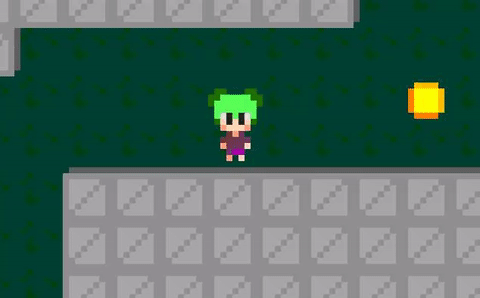
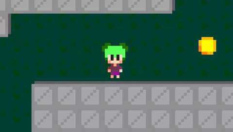
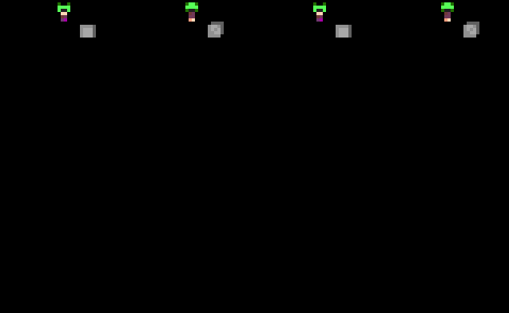
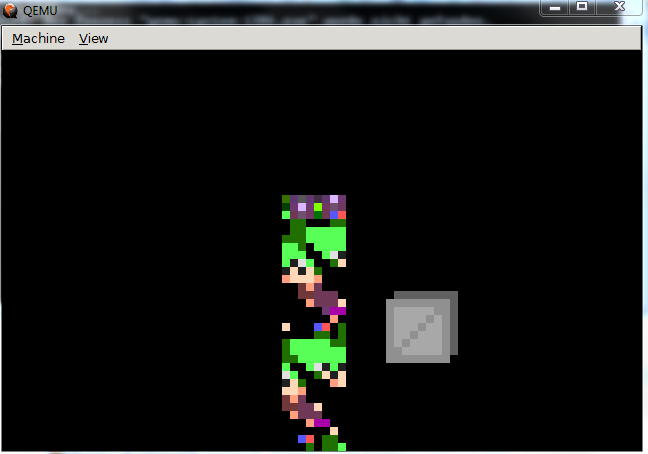

# Realmode Assembly - Writing bootable stuff
## Part 7: Let's write a small game (2/2)

----------

## What is this?

This is going to be a walk-through in writing an Operation System in assembly which operates purely in Realmode.
Goal will be writing different kernels from a simple "Hello World" over small terminal programs to
graphically displayed games.

This will probably be the last part of the series as well.

## Requirements

* Being able to read x86 Intel Assembly
* Being tolerant enough to accept my assembly code even though it might not be perfect
* Reading the previous articles

## Notes

* This information is the result of my research and own programming, everything said here might be wrong, correct me if you spot mistakes though!
* I will try to list my sources at the bottom but I can't guarantee that these are all of them.
* I'M NOT RESPONSIBLE IF YOU BREAK SOMETHING USING INFORMATION I PROVIDED HERE.

## Content of this Article

This article will be about utilizing hardware interrupts (and how to handle interrupts in general) and how to use them to make the controls of the small test game asynchronous.
Again the rest of the article consists of skipping over the development of the last example to a somewhat finished state of being a small "game".
If you are actually interested in the implementation of the game you can take a look into the git project! :D

I've also again included a few pictures of bugs in development because they are always fun to look at (and debug :P)

----------

## Interrupts you say?

Interrupts are signals raised from the CPU or from external Hardware (Keyboard, Mouse) that tell the CPU to save the current execution context, stop doing what it was doing and give execution to the handler for the specific event.
Exceptions are as one example handled in that way in Realmode, but also keydown/keyup events from a keyboard get send to the CPU in this way to notify it of changes.
In Realmode the interrupt handler addresses are stored in the Interrupt Vector Table (contrary to the Interrupt Descriptor Table used in protected mode) which is usually positioned at 0000:000 for comp ability reasons.
Each entry in the Interrupt Vector Table (IVT) is 4 byte in size where the first two byte are representing the segment of the handler and the last two byte the offset from there to the handler, because of this very simple format we can find the position of the handler address by multiplying the interrupt number with 4 where we can then overwrite the segment:offset structure there to point to custom handler. 

## Writing a custom key event handler

Based on the simple structure of the IVT (and a handy IVT mapping from osdev) we can overwrite the keyboard interrupt handler pretty easily

    IVT Offset | INT # | IRQ # | Description
    -----------+-------+-------+------------------------------
    0x0020     | 0x08  | 0     | PIT
    0x0024     | 0x09  | 1     | Keyboard                       <-- We will overwrite this
    0x0028     | 0x0A  | 2     | 8259A slave controller
    0x002C     | 0x0B  | 3     | COM2 / COM4
    0x0030     | 0x0C  | 4     | COM1 / COM3
    0x0034     | 0x0D  | 5     | LPT2
    0x0038     | 0x0E  | 6     | Floppy controller
    0x003C     | 0x0F  | 7     | LPT1


```asm
registerInterruptHandlers:
	mov [0x0024], dword keyboardINTListener ;implements keyboardListener
	ret
```
So now we will get all interrupts triggered by the keyboard (or through a software interrupt 9) in our keyboardINTListener function.
Now let's look into implementing the actual handler function:

First of all we have to remember that this event is asynchronous to the other tasks the CPU does, so when entering our function we could (and will) have arbitrary values (from the functions that were executed previously) in not only our normal working registers but also in the segment registers which is why we can't assume any predictable values in them.
Also it's important to know that after the interrupt handler is ended with a IRET instruction the execution will continue at the previous position with the current register values which means we also have to watch out to reset everything to the state it was before calling our handler to prevent crashes and unexpected behaviour.

Now looking at the keyboard handler itself we have to make sure that we tell the Programmable Interrupt Controller (PIC) that passed the signal through from the keyboard that it arrived correctly at the end of our code to assure that it keeps sending us future interrupts.
```asm
    mov al, 20h ;20h
    out 20h, al ;acknowledge the interrupt so further interrupts can be handled again 
```
As you can see in this code snippet we do this by sending a 0x20 through the IO port 0x20. Depending on the interrupt it might be needed to send this signal to a slave PIC as well.

Reading the current key status itself is rather simple as we directly pull it from the IO port 0x60 which is the PS/2 Keyboard and Mouse Port (Don't worry because of the way Keyboards are handled on modern systems a USB Keyboard will be treated as a PS/2 here).
Note here that the key mappings are not in ASCII or similar format but have their own (Link for file containing the mapping in the References section).

Now the last part we can't forget about is that because of the asynchronous nature of interrupts we can't move the player in the handler if we somehow want it synchronous to game and render ticks which means we have to save the state from the handler in memory which then can be read synchronously.

```asm
pressA db 0
pressD db 0
pressW db 0
pressS db 0
keyboardINTListener: ;interrupt handler for keyboard events
	pusha	
		xor bx,bx ; bx = 0: signify key down event
		inc bx
		in al,0x60 ;get input to AX, 0x60 = ps/2 first port for keyboard
		btr ax, 7 ;al now contains the key code without key pressed flag, also carry flag set if key up event
		jnc .keyDown
			dec bx ; bx = 1: key up event
		.keyDown:
		cmp al,0x1e ;a
		jne .check1         
			mov byte [cs:pressA], bl ;use cs overwrite because we don't know where the data segment might point to
		.check1:
		cmp al,0x20 ;d
		jne .check2
			mov byte [cs:pressD], bl
		.check2:
		cmp al,0x11 ;w
		jne .check3
			mov byte [cs:pressW], bl
		.check3:
		cmp al,0x1f ;s
		jne .check4
			mov byte [cs:pressS], bl
		.check4:
		mov al, 20h ;20h
		out 20h, al ;acknowledge the interrupt so further interrupts can be handled again 
	popa ;resume state to not modify something by accident
	iret ;return from an interrupt routine
```

After implementing this (and a few more things) a new problem appeared which already existed when booting the kernel on a real system instead of an emulator:



Because we don't have any limitations on the game speed it runs as fast as the processor can, which makes movement quite troublesome.

## Sleeping for a fixed amount of time

To actually maneuver in this now even in the emulator fast environment we need to slow it down.
Because the game speed should be similar on different devices (and emulators) it makes sense to use a BIOS provided interrupt for that.

```plain
|----int----|--ah--|----cx-----|----dx----|------CF------|---------Description---------|
|  int 0x15 | 0x68 | High Word | Low Word | Set if Error | Wait for CX:DX Microseconds |
|-----------|------|-----------|----------|--------------|-----------------------------|
```

```asm
synchronize:
	pusha
		mov si, 20 ; si = time in ms
		mov dx, si
		mov cx, si
		shr cx, 6
		shl dx, 10
		mov ah, 86h
		int 15h ;cx,dx sleep time in microseconds - cx = high word, dx = low word
	popa
	ret
```

Now after having this sleep time in the code it works at acceptable speed both in the emulator and on a real system




## Final Conclusion

So now after after 7 parts we went over the theory of how the booting process works,to basic text output,input and processing and ended with a small bootable "game" runnable on most x86 systems. Content wise there isn't much to it, just running around and collecting coins but then again that's just a small example of what you can do with not too much effort.
I know that the last parts were getting released pretty delayed from each other but I still hope that this series was somewhat interesting and motivating to look into the lower level inner workings of operation systems and programs in general.
If you any mistakes please point them out to me so I can correct them, also again feedback to the series is appreciated :)

Thank you for taking your time to read through or parts of my series!

## Some Development Screenshots

Also as I promised let's end it with some (buggy) development screenshots:



When writing the code scaling images up this happened



I messed up the address of the play sprite resulting in this


Here I loaded up the wrong address for the base of the map, resulting in rendering the code positioned there


When I optimized the world rendering I at some point choose a too small radius resulting in this

### [Previous Part](https://github.com/Pusty/realmode-assembly/part6)

----------

## Link to source files:
* https://github.com/Pusty/realmode-assembly/part7


## Sources and References
* https://wiki.osdev.org/Interrupt_Vector_Table
* https://wiki.osdev.org/IDT
* https://en.wikipedia.org/wiki/Interrupt_descriptor_table
* http://inglorion.net/documents/tutorials/x86ostut/keyboard/us_keymap.inc
* http://stanislavs.org/helppc/int_15-86.html
